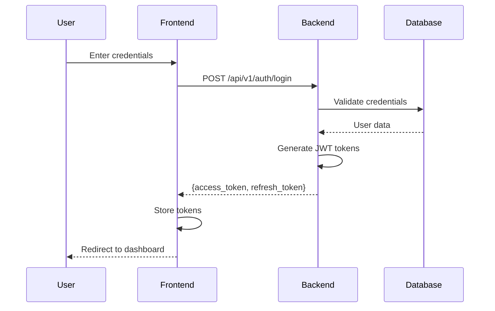
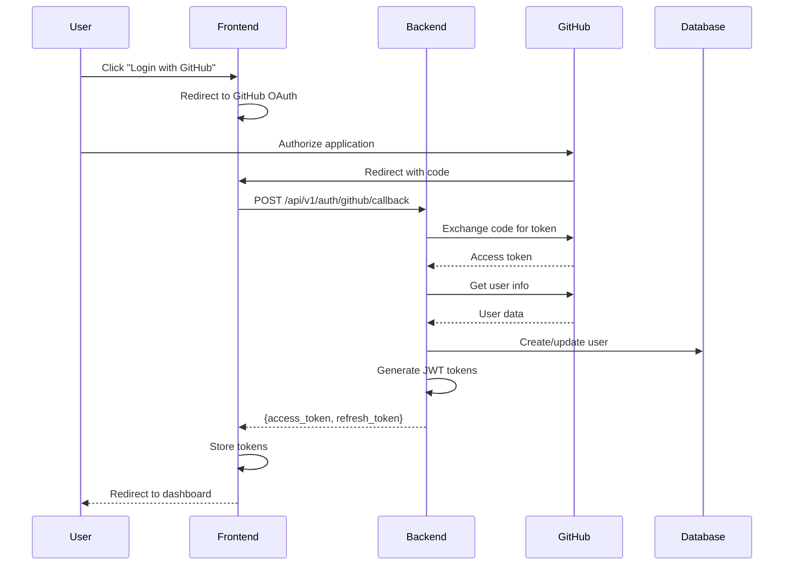

# PlotWeaver Authentication Flow Documentation

## Overview

PlotWeaver uses a JWT-based authentication system with support for both traditional username/password login and GitHub OAuth. The system supports optional authentication for certain endpoints, allowing anonymous users to submit feedback while providing enhanced features for authenticated users.

## Authentication Methods

### 1. Username/Password Authentication

#### Login Flow


#### Request/Response Format
```typescript
// Request
POST /api/v1/auth/login
{
  "username": "user@example.com",
  "password": "securepassword"
}

// Response
{
  "access_token": "eyJ0eXAiOiJKV1QiLCJhbGc...",
  "refresh_token": "eyJ0eXAiOiJKV1QiLCJhbGc...",
  "token_type": "bearer",
  "expires_in": 3600,
  "user": {
    "id": "uuid-here",
    "username": "user@example.com",
    "email": "user@example.com",
    "is_admin": false,
    "created_at": "2024-01-01T00:00:00Z"
  }
}
```

### 2. GitHub OAuth Authentication

#### OAuth Flow


#### GitHub OAuth Configuration
```python
# Backend configuration
GITHUB_CLIENT_ID = os.getenv("GITHUB_CLIENT_ID")
GITHUB_CLIENT_SECRET = os.getenv("GITHUB_CLIENT_SECRET")
GITHUB_REDIRECT_URI = os.getenv("GITHUB_REDIRECT_URI", "http://localhost:3000/auth/github/callback")

# OAuth URLs
GITHUB_AUTHORIZE_URL = "https://github.com/login/oauth/authorize"
GITHUB_TOKEN_URL = "https://github.com/login/oauth/access_token"
GITHUB_USER_URL = "https://api.github.com/user"
```

## Token Management

### Access Token Structure
```json
{
  "sub": "user-uuid",
  "username": "user@example.com",
  "email": "user@example.com",
  "is_admin": false,
  "exp": 1234567890,
  "iat": 1234567890,
  "type": "access"
}
```

### Refresh Token Structure
```json
{
  "sub": "user-uuid",
  "exp": 1234567890,
  "iat": 1234567890,
  "type": "refresh"
}
```

### Token Storage (Frontend)

```typescript
// Secure storage implementation
class TokenStorage {
  private static ACCESS_TOKEN_KEY = 'pw_access_token';
  private static REFRESH_TOKEN_KEY = 'pw_refresh_token';
  
  static setTokens(tokens: AuthTokens): void {
    // Store in httpOnly cookie (preferred)
    document.cookie = `${this.ACCESS_TOKEN_KEY}=${tokens.access_token}; Secure; SameSite=Strict; Path=/`;
    
    // Fallback to sessionStorage for SPAs
    sessionStorage.setItem(this.ACCESS_TOKEN_KEY, tokens.access_token);
    
    // Refresh token in secure storage only
    sessionStorage.setItem(this.REFRESH_TOKEN_KEY, tokens.refresh_token);
  }
  
  static getAccessToken(): string | null {
    // Check cookie first
    const cookie = document.cookie
      .split('; ')
      .find(row => row.startsWith(this.ACCESS_TOKEN_KEY));
    
    if (cookie) {
      return cookie.split('=')[1];
    }
    
    // Fallback to sessionStorage
    return sessionStorage.getItem(this.ACCESS_TOKEN_KEY);
  }
  
  static clearTokens(): void {
    // Clear cookie
    document.cookie = `${this.ACCESS_TOKEN_KEY}=; expires=Thu, 01 Jan 1970 00:00:00 UTC; path=/;`;
    
    // Clear storage
    sessionStorage.removeItem(this.ACCESS_TOKEN_KEY);
    sessionStorage.removeItem(this.REFRESH_TOKEN_KEY);
  }
}
```

### Token Refresh Flow

```typescript
// Automatic token refresh
class AuthService {
  private refreshPromise: Promise<AuthTokens> | null = null;
  
  async refreshToken(): Promise<AuthTokens> {
    // Prevent multiple simultaneous refresh attempts
    if (this.refreshPromise) {
      return this.refreshPromise;
    }
    
    this.refreshPromise = this.doRefresh();
    
    try {
      const tokens = await this.refreshPromise;
      return tokens;
    } finally {
      this.refreshPromise = null;
    }
  }
  
  private async doRefresh(): Promise<AuthTokens> {
    const refreshToken = TokenStorage.getRefreshToken();
    
    if (!refreshToken) {
      throw new Error('No refresh token available');
    }
    
    const response = await fetch('/api/v1/auth/refresh', {
      method: 'POST',
      headers: {
        'Content-Type': 'application/json',
      },
      body: JSON.stringify({ refresh_token: refreshToken }),
    });
    
    if (!response.ok) {
      throw new Error('Token refresh failed');
    }
    
    const tokens = await response.json();
    TokenStorage.setTokens(tokens);
    
    return tokens;
  }
}
```

## Request Authentication

### Authenticated Request Flow

```typescript
// API client with automatic authentication
class ApiClient {
  private async authenticatedRequest<T>(
    url: string,
    options: RequestInit = {}
  ): Promise<T> {
    let token = TokenStorage.getAccessToken();
    
    // Check if token is expired
    if (token && this.isTokenExpired(token)) {
      try {
        const tokens = await authService.refreshToken();
        token = tokens.access_token;
      } catch (error) {
        // Refresh failed, redirect to login
        authService.logout();
        throw new AuthenticationError('Session expired');
      }
    }
    
    const response = await fetch(url, {
      ...options,
      headers: {
        ...options.headers,
        'Authorization': token ? `Bearer ${token}` : '',
      },
    });
    
    if (response.status === 401) {
      // Token invalid, try refresh
      const tokens = await authService.refreshToken();
      
      // Retry with new token
      return this.authenticatedRequest(url, {
        ...options,
        headers: {
          ...options.headers,
          'Authorization': `Bearer ${tokens.access_token}`,
        },
      });
    }
    
    return response.json();
  }
  
  private isTokenExpired(token: string): boolean {
    try {
      const payload = JSON.parse(atob(token.split('.')[1]));
      return payload.exp * 1000 < Date.now();
    } catch {
      return true;
    }
  }
}
```

## Backend Authentication Middleware

### Current User Dependency

```python
from fastapi import Depends, HTTPException, status
from fastapi.security import HTTPBearer, HTTPAuthorizationCredentials

security = HTTPBearer()

async def get_current_user(
    credentials: HTTPAuthorizationCredentials = Depends(security)
) -> dict:
    """Validate JWT token and return user data."""
    token = credentials.credentials
    
    try:
        # Decode and validate token
        payload = jwt.decode(
            token,
            settings.SECRET_KEY,
            algorithms=["HS256"]
        )
        
        # Check token type
        if payload.get("type") != "access":
            raise HTTPException(
                status_code=status.HTTP_401_UNAUTHORIZED,
                detail="Invalid token type"
            )
        
        # Get user from database
        user = await User.get(id=payload["sub"])
        if not user:
            raise HTTPException(
                status_code=status.HTTP_401_UNAUTHORIZED,
                detail="User not found"
            )
        
        return user.dict()
        
    except jwt.ExpiredSignatureError:
        raise HTTPException(
            status_code=status.HTTP_401_UNAUTHORIZED,
            detail="Token expired"
        )
    except jwt.InvalidTokenError:
        raise HTTPException(
            status_code=status.HTTP_401_UNAUTHORIZED,
            detail="Invalid token"
        )
```

### Optional Authentication

```python
async def get_current_user_optional(
    authorization: Optional[str] = Header(None)
) -> Optional[dict]:
    """Get current user if authenticated, None otherwise."""
    if not authorization or not authorization.startswith("Bearer "):
        return None
    
    try:
        token = authorization.split(" ")[1]
        credentials = HTTPAuthorizationCredentials(
            scheme="Bearer",
            credentials=token
        )
        return await get_current_user(credentials)
    except HTTPException:
        return None
```

## Permission System

### Role-Based Access Control

```python
# User roles
class UserRole(str, Enum):
    ADMIN = "admin"
    USER = "user"
    GUEST = "guest"

# Permission decorator
def require_role(role: UserRole):
    async def role_checker(
        current_user: dict = Depends(get_current_user)
    ):
        user_role = UserRole(current_user.get("role", "user"))
        if user_role != role and user_role != UserRole.ADMIN:
            raise HTTPException(
                status_code=status.HTTP_403_FORBIDDEN,
                detail="Insufficient permissions"
            )
        return current_user
    return role_checker

# Usage in routes
@router.delete("/projects/{project_id}")
async def delete_project(
    project_id: str,
    current_user: dict = Depends(require_role(UserRole.ADMIN))
):
    """Admin-only endpoint."""
    pass
```

### Project-Level Permissions

```python
async def check_project_access(
    project_id: str,
    current_user: dict = Depends(get_current_user),
    required_permission: str = "read"
) -> bool:
    """Check if user has access to project."""
    # Check if user is admin
    if current_user.get("is_admin"):
        return True
    
    # Check project membership
    membership = await ProjectMembership.get(
        user_id=current_user["id"],
        project_id=project_id
    )
    
    if not membership:
        raise HTTPException(
            status_code=status.HTTP_403_FORBIDDEN,
            detail="Access denied"
        )
    
    # Check permission level
    if required_permission == "write" and membership.role == "viewer":
        raise HTTPException(
            status_code=status.HTTP_403_FORBIDDEN,
            detail="Write access required"
        )
    
    return True
```

## Session Management

### Session ID Generation

```typescript
// Frontend session management
class SessionManager {
  private sessionId: string;
  
  constructor() {
    this.sessionId = this.getOrCreateSessionId();
  }
  
  private getOrCreateSessionId(): string {
    let sessionId = sessionStorage.getItem('pw_session_id');
    
    if (!sessionId) {
      sessionId = this.generateSessionId();
      sessionStorage.setItem('pw_session_id', sessionId);
    }
    
    return sessionId;
  }
  
  private generateSessionId(): string {
    return `${Date.now()}-${Math.random().toString(36).substr(2, 9)}`;
  }
  
  getSessionId(): string {
    return this.sessionId;
  }
  
  clearSession(): void {
    sessionStorage.removeItem('pw_session_id');
    this.sessionId = this.generateSessionId();
  }
}
```

### Session Headers

```typescript
// Include session ID in all requests
const apiClient = {
  async request(url: string, options: RequestInit = {}) {
    const sessionId = sessionManager.getSessionId();
    
    return fetch(url, {
      ...options,
      headers: {
        ...options.headers,
        'X-Session-ID': sessionId,
      },
    });
  },
};
```

## Security Best Practices

### 1. Token Security
- Use httpOnly cookies when possible
- Short expiration times (15-30 minutes for access tokens)
- Longer expiration for refresh tokens (7-30 days)
- Secure token transmission (HTTPS only)

### 2. CORS Configuration
```python
# Strict CORS settings
app.add_middleware(
    CORSMiddleware,
    allow_origins=["http://localhost:3000", "https://app.plotweaver.com"],
    allow_credentials=True,
    allow_methods=["GET", "POST", "PUT", "DELETE", "PATCH"],
    allow_headers=["Authorization", "Content-Type", "X-Session-ID"],
)
```

### 3. Rate Limiting
```python
# Prevent brute force attacks
from slowapi import Limiter

limiter = Limiter(key_func=lambda: get_remote_address)

@app.post("/api/v1/auth/login")
@limiter.limit("5/minute")
async def login(request: Request, credentials: LoginRequest):
    """Rate-limited login endpoint."""
    pass
```

### 4. Input Validation
```python
# Pydantic models for validation
class LoginRequest(BaseModel):
    username: EmailStr
    password: constr(min_length=8, max_length=128)
    
    @validator('password')
    def validate_password(cls, v):
        if not re.match(r'^(?=.*[A-Za-z])(?=.*\d)', v):
            raise ValueError('Password must contain letters and numbers')
        return v
```

## Monitoring & Logging

### Authentication Events
```python
# Log authentication events
async def log_auth_event(
    event_type: str,
    user_id: Optional[str],
    success: bool,
    ip_address: str,
    user_agent: str
):
    await AuthLog.create(
        event_type=event_type,
        user_id=user_id,
        success=success,
        ip_address=ip_address,
        user_agent=user_agent,
        timestamp=datetime.utcnow()
    )
```

### Metrics to Track
1. Login success/failure rates
2. Token refresh frequency
3. Session duration
4. Authentication method usage
5. Failed authentication attempts by IP

## Troubleshooting

### Common Issues

1. **Token Expired**
   - Automatic refresh should handle this
   - If refresh fails, redirect to login

2. **CORS Errors**
   - Verify allowed origins
   - Check credentials flag

3. **Session Loss**
   - Check cookie settings
   - Verify SameSite policy

4. **OAuth Redirect Issues**
   - Verify redirect URI configuration
   - Check GitHub app settings

## Migration Strategy

### From Anonymous to Authenticated
```typescript
// Preserve anonymous user data
async function migrateAnonymousUser(anonymousId: string, userId: string) {
  // Transfer feedback
  await api.post('/api/v1/users/migrate', {
    anonymous_id: anonymousId,
    user_id: userId,
    migrate_feedback: true,
    migrate_events: true,
  });
}
```

This authentication system provides a secure, flexible foundation for PlotWeaver's user management while supporting both authenticated and anonymous usage patterns.